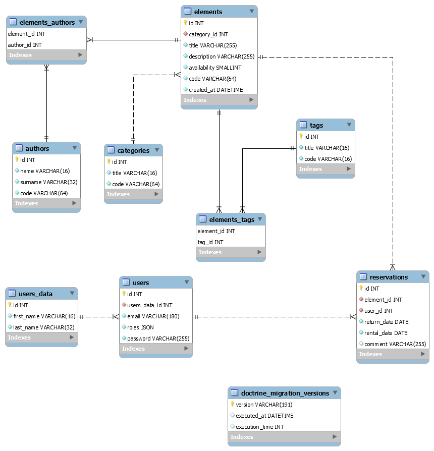

# Online Rental Service

The application that I wrote for the 'interactive project' course assignment at university.

## Features

* User account (registration, editing account information, changing password)
* Administrator (login, changing password, changing administrator information)
* Administrator with the ability to create, edit and delete content on the website, and an unregistered user with the ability to browse content on the     website and borrow resources
* CRUD for catalog items (books, music, etc.)
* CRUD for categories, linking categories with items
* CRUD for publishers, linking publishers with items
* CRUD for tags, tagging resources
* Filtering the list of items based on tags
* Displaying the list of items for a given category
* List of records from newest to oldest with pagination of 10 records per page
* Borrowing resources only for registered users
* Registered user has the ability to preview currently borrowed resources
* User account management by the administrator (changing password, changing information)

## Database 


# Docker Symfony

Starter kit is based on [The perfect kit starter for a Symfony 4 project with Docker and PHP 7.2](https://medium.com/@romaricp/the-perfect-kit-starter-for-a-symfony-4-project-with-docker-and-php-7-2-fda447b6bca1).

## What is inside?

* Apache 2.4.25 (Debian)
* PHP 7.4 FPM
* MySQL 8.0.x (5.7)
* NodeJS 13.x
* Composer
* Symfony CLI 
* xdebug
* djfarrelly/maildev

## Requirements

* Install [Docker](https://www.docker.com/products/docker-desktop) and [Docker Compose](https://docs.docker.com/compose/install) on your machine 

## Installation

* (optional) Add 

```bash
127.0.0.1   sf.local
```
in your `host` file.

* Run `build-env.sh` (or `build-env.ps1` on Windows box)

* Enter the PHP container:

```bash
docker-compose exec php bash
```

* To install Symfony LTS inside container execute:

```bash
cd sf
rm .gitkeep
git config --global user.email "you@example.com"
symfony new ../sf --full --version=lts
chown -R dev.dev *
```

## Container URLs and ports

* Project URL

```bash
http://localhost:8000
```

or 

```bash
http://sf.local:8000
```

* MySQL

    * inside container: host is `mysql`, port: `3306`
    * outside container: host is `localhost`, port: `3307`
    * passwords, db name are in `docker-compose.yml`
    
* djfarrelly/maildev i available from the browser on port `8001`

* xdebug i available remotely on port `9000`

* Database connection in Symfony `.env` file:
```yaml
DATABASE_URL=mysql://sf:sf@mysql:3306/sf?serverVersion=5.7
```

## Useful commands

* `docker-compose up -d` - start containers
* `docker-compose down` - stop contaniners
* `docker-compose exec php bash` - enter into PHP container
* `docker-compose exec mysql bash` - enter into MySQL container
* `docker-compose exec apache bash` - enter into Apache2 container

# Server installation

1. Copy the "app" directory to the server.

2. Set the database access parameters in the .env file.

3. Create a file named .htaccess in the "public" directory with the following content:
```
 <IfModule mod_rewrite.c>
 	Options -MultiViews
 	RewriteEngine On
	RewriteCond %{REQUEST_FILENAME} !-f
 	RewriteRule ^(.*)$ index.php [QSA,L]
 </IfModule>
 <IfModule !mod_rewrite.c>
 <IfModule mod_alias.c>
	RedirectMatch 302 ^/$ /index.php/
 </IfModule>
 </IfModule>
 ```

4. Run the following commands in the project directory:
		
```
composer install
php bin/console doctrine:migrations:migrate
php bin/console doctrine:fixtures:load
```

